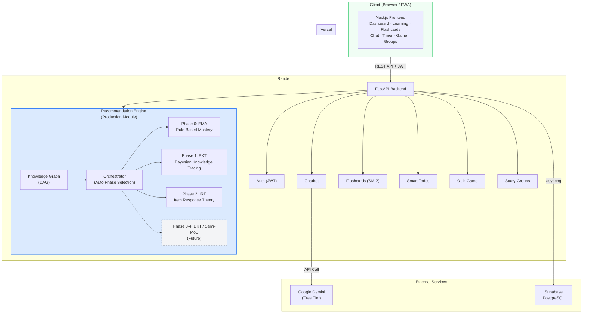
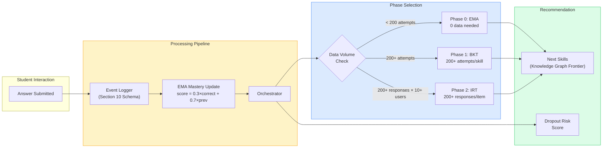
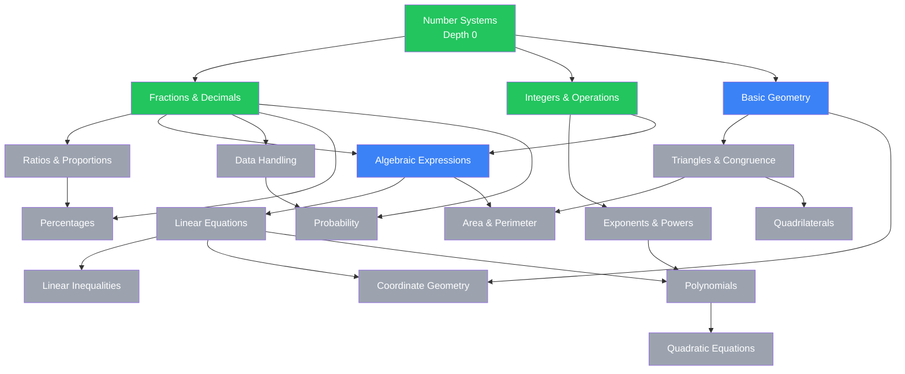

# Anvesh

### Adaptive Smart Education Platform with Multi-Phase Recommendation Engine
**Smart India Hackathon 2026 · Problem Statement 26207 · Smart Education**

[](backend)
[](frontend)
[-4169E1.svg?logo=postgresql&logoColor=white)](backend/app/models.py)
[](backend/app/chatbot.py)
[](backend/app/recommendation)
[](backend/app/flashcards.py)
[](#pwa--offline-support)
[](LICENSE)

---

## The Problem

India's education system serves 250M+ students with one-size-fits-all teaching. The core failure is a **personalization gap**:

- **No Adaptive Paths:** A Class 8 student struggling with fractions receives the same algebra content as one who mastered it weeks ago. Existing platforms recommend by grade, not by individual mastery.
- **Engagement Cliff:** 30%+ students disengage before completing a topic because content difficulty doesn't match their level (ASER 2023). There is no system to detect dropout risk before it happens.
- **Retention Decay:** Students cram before exams and forget within weeks. No platform integrates scientifically proven spaced repetition into the learning flow.
- **Content Isolation:** Learning videos, practice questions, revision cards, and study planning live in separate apps with no connection between them.

**Anvesh eliminates this personalization gap with an adaptive recommendation engine that builds a unique learning path for every student, tracks mastery using proven algorithms, and evolves automatically from rule-based to ML-driven as data accumulates.**

---

## The Solution

A unified adaptive learning platform where every feature is connected to a single intelligence layer:

1. **Adaptive Recommendation Engine (`backend/app/recommendation/`):**
   - **Knowledge Graph DAG:** Skills organized as a prerequisite tree. The system always recommends the deepest skill whose prerequisites are mastered — mathematically optimal learning path.
   - **Phase 0 — EMA Mastery:** `mastery(t) = 0.3 × correct(t) + 0.7 × mastery(t-1)`. Works from Day 1 with zero prior data. Mastery declared at ≥0.75 for 3 consecutive attempts.
   - **Phase 1 — Bayesian Knowledge Tracing:** Hidden Markov Model tracking P(learned), P(guess), P(slip), P(transit). Auto-activates at 200+ attempts per skill.
   - **Phase 2 — Item Response Theory (2PL):** Calibrates question difficulty and student ability. Auto-activates at 200+ responses per item across 10+ users.
   - **Orchestrator:** Auto-selects the best available phase per skill based on data volume. No manual intervention, no redeployment.

2. **AI Tutor Chatbot:**
   - Google Gemini-powered, context-aware (knows the student's current topic and mastery level).
   - Persistent chat history in database. Voice output via browser SpeechSynthesis API.

3. **Spaced Repetition Flashcards:**
   - SM-2 algorithm (used by 10M+ Anki users) schedules reviews at mathematically optimal intervals.
   - Cards optionally linked to knowledge graph skills. Shareable across study groups.

4. **Smart To-Do List:**
   - Auto-suggests study tasks based on knowledge graph gaps ("Study Linear Equations — prerequisites mastered").
   - Carries forward incomplete tasks from previous days.

5. **Gamification:**
   - Quiz games unlock after 60 minutes of focused study (Pomodoro timer tracked).
   - Questions pulled from the knowledge graph. Scores recorded per skill.

6. **Study Groups & Collaboration:**
   - Create groups with invite codes. Share flashcard decks. View peers' mastery progress.

7. **PWA & Offline Support:**
   - Works on low-bandwidth connections. Cached flashcard review offline. Reaches rural and underserved students.

---

## System Architecture



### Recommendation Engine Pipeline



---

## What Makes Anvesh Different

### 1. Multi-Phase Adaptive Engine That Evolves With Data
Most EdTech platforms pick one recommendation algorithm and stick with it. Anvesh implements a **progressive phase architecture**: rule-based EMA on Day 1 (zero data), Bayesian Knowledge Tracing at 200 attempts, Item Response Theory at 200 responses per item. The orchestrator auto-selects the best phase per skill — the system becomes more intelligent automatically as students use it, with no manual tuning or redeployment.

### 2. Knowledge Graph-Driven Prerequisite Paths
Skills are modeled as a **Directed Acyclic Graph (DAG)** with prerequisite edges. The recommendation engine performs frontier analysis: it finds the deepest unmastered skill whose prerequisites are all mastered. This guarantees students never encounter content they're not ready for, and never waste time on content they've already mastered.

### 3. Production-Grade Reusable Module
The `recommendation/` package is designed as a **standalone microservice** with a stable `SkillStateProvider` interface. It can be extracted and integrated into any existing EdTech platform via HTTP. Already on the production roadmap of ARiTHi Education Technology.

### 4. Event Logging Pipeline from Day 1
Every student interaction (answers, response times, video watches, hints) is recorded in a structured schema from the first session. This isn't just analytics — it's the **training data pipeline** that enables BKT, IRT, and future deep learning phases. Most platforms bolt on analytics later; Anvesh treats data collection as a core architectural requirement.

### 5. Scientifically Backed Retention System
SM-2 spaced repetition (Wozniak 1994) is integrated directly into the learning flow, not as a separate app. Flashcards are linked to knowledge graph skills. The system knows what you're learning and schedules reviews accordingly.

---

## Feature Comparison

| Capability | Anvesh | Traditional EdTech Platforms |
| :--- | :--- | :--- |
| **Content Recommendation** | **Multi-phase adaptive** (EMA → BKT → IRT → DKT) | Static grade-based or collaborative filtering |
| **Prerequisite Modeling** | **Knowledge Graph DAG** with frontier analysis | Flat topic lists or manual course ordering |
| **Cold Start** | **Zero data needed** — Phase 0 works instantly | Requires historical data or manual setup |
| **Algorithm Evolution** | **Auto-upgrades** as data accumulates | Fixed algorithm, manual model retraining |
| **Retention System** | **SM-2 spaced repetition** linked to skills | Separate flashcard apps or no spaced repetition |
| **Dropout Detection** | **Risk scoring** from learning event patterns | No early warning system |
| **AI Tutoring** | **Context-aware chatbot** (Gemini, knows current skill) | Generic chatbot or no AI support |
| **Collaboration** | **Study groups** with shared decks and mastery visibility | No peer learning features |
| **Offline Support** | **PWA** with cached flashcard review | Requires constant internet |
| **Data Pipeline** | **Event logging from Day 1** for ML readiness | Analytics added as an afterthought |

---

## Tech Stack

| Layer | Technology | Purpose |
| :--- | :--- | :--- |
| **Backend API** | FastAPI, Python 3.13 | Async REST API, Pydantic validation |
| **Database** | PostgreSQL 16 (Supabase) | 11-table schema, event logging pipeline |
| **ORM & Migrations** | SQLAlchemy (async) + Alembic | Type-safe models, version-controlled schema |
| **Recommendation** | NumPy, SciPy | EMA, BKT (HMM), IRT (2PL MLE) |
| **AI Chatbot** | Google Gemini API | Context-aware tutoring, free tier |
| **Auth** | python-jose, passlib (bcrypt) | JWT token authentication |
| **Frontend** | Next.js, React, Tailwind CSS | Responsive dashboard, PWA |
| **Deployment** | Vercel (web), Render (API), Supabase (DB) | Zero-cost free tier deployment |

---

## Knowledge Graph

The recommendation engine is powered by a skill prerequisite graph. Here's the seed graph for 8th grade mathematics (18 nodes):



**Legend:** 🟢 Mastered → 🔵 Available (prerequisites met) → ⚪ Locked

---

## Recommendation Engine Phases

| Phase | Algorithm | Data Required | Activation | Key Formula |
| :--- | :--- | :--- | :--- | :--- |
| **0 — EMA** | Exponential Moving Average | Zero | Day 1 | `mastery(t) = 0.3 × correct(t) + 0.7 × mastery(t-1)` |
| **1 — BKT** | Bayesian Knowledge Tracing (HMM) | 200+ attempts/skill | Auto | Forward algorithm: P(L), P(T), P(G), P(S) |
| **2 — IRT** | Item Response Theory (2PL) | 200+ responses/item, 10+ users | Auto | `P(correct) = 1 / (1 + exp(-a(θ-b)))` |
| **3 — DKT** | Deep Knowledge Tracing (LSTM) | 1000+ students | Future | Sequence model over attempt histories |
| **4 — Semi-MoE** | Mixture-of-Experts Transformer | 5000+ students | Future | Expert routing by content type |

The `SkillStateProvider` interface remains identical across all phases. The orchestrator auto-selects the highest viable phase per skill:

```
IRT (most data) → BKT → EMA (fallback)
```

---

## Local Development Setup

### 1. Prerequisites

- [Miniconda](https://docs.conda.io/en/latest/miniconda.html) or Python 3.13+
- [Docker](https://www.docker.com/) (for local PostgreSQL) or a [Supabase](https://supabase.com/) project
- [Node.js 20+](https://nodejs.org/) (for frontend)

### 2. Backend Setup

```bash
# Create conda environment
conda create -n anvesh python=3.13 -y
conda activate anvesh

# Install dependencies
cd backend
pip install -r requirements.txt

# Configure environment
cp .env.example .env
# Edit .env with your DATABASE_URL, JWT_SECRET, GEMINI_API_KEY

# Start local PostgreSQL (if using Docker)
cd ..
docker compose up -d

# Run database migrations
cd backend
alembic upgrade head

# Seed demo accounts
python seed.py

# Start the server
uvicorn app.main:app --reload --port 8000
```

### 3. Frontend Setup

```bash
cd frontend
npm install
cp .env.local.example .env.local
# Set NEXT_PUBLIC_API_URL=http://localhost:8000
npm run dev
```

### 4. Demo Credentials

| Name | Email | Password |
| :--- | :--- | :--- |
| Demo Student | `demo@anvesh.in` | `demo1234` |
| Adarsh | `adarsh@anvesh.in` | `adarsh1234` |
| Test Student | `test@anvesh.in` | `test1234` |

---

## Project Structure

```
Anvesh/
├── backend/
│   ├── app/
│   │   ├── recommendation/              # Production-grade reusable module
│   │   │   ├── interface.py              # SkillStateProvider protocol (stable contract)
│   │   │   ├── knowledge_graph.py        # DAG loader, validation, frontier analysis
│   │   │   ├── ema.py                    # Phase 0 — EMA mastery tracking
│   │   │   ├── bkt.py                    # Phase 1 — Bayesian Knowledge Tracing (HMM + EM fitting)
│   │   │   ├── irt.py                    # Phase 2 — Item Response Theory (2PL + MLE)
│   │   │   ├── orchestrator.py           # Auto phase selection per skill
│   │   │   ├── event_logger.py           # Section 10 event instrumentation
│   │   │   └── router.py                 # /api/recommend/* endpoints
│   │   ├── auth.py                       # JWT authentication + demo accounts
│   │   ├── chatbot.py                    # Google Gemini AI tutor + persistent history
│   │   ├── flashcards.py                 # CRUD + SM-2 spaced repetition
│   │   ├── todos.py                      # Smart todos + carry-forward + suggestions
│   │   ├── videos.py                     # User-contributed YouTube URLs per skill
│   │   ├── study_groups.py               # Groups, invite codes, shared decks
│   │   ├── game.py                       # Quiz game (unlocks after study time)
│   │   ├── models.py                     # 11 SQLAlchemy models
│   │   ├── main.py                       # FastAPI application entrypoint
│   │   ├── config.py                     # Pydantic settings
│   │   ├── database.py                   # Async SQLAlchemy engine
│   │   └── deps.py                       # Auth dependency injection
│   ├── data/
│   │   └── knowledge_graph.json          # Seed knowledge graph (18 nodes, 8th grade math)
│   ├── alembic/                          # Database migrations
│   ├── seed.py                           # Demo account seeder
│   ├── requirements.txt
│   └── Dockerfile
├── frontend/                             # Next.js (teammate-managed)
├── docs/
│   ├── ppt-script.md                     # SIH 2026 presentation content
│   ├── frontend-guide.md                 # Frontend implementation guide with all API specs
│   └── diagrams.md                       # Mermaid architecture diagrams
├── docker-compose.yml                    # Local PostgreSQL
└── .env.example
```

---

## API Reference

### Authentication
| Method | Endpoint | Description |
| :--- | :--- | :--- |
| POST | `/api/auth/login` | Login with email + password → JWT token |
| POST | `/api/auth/register` | Register new account → JWT token |

### Recommendation Engine
| Method | Endpoint | Description |
| :--- | :--- | :--- |
| GET | `/api/recommend/next` | Get next recommended skills + videos |
| POST | `/api/recommend/answer` | Submit answer → updates mastery + recommendations |
| GET | `/api/recommend/mastery` | All skill mastery scores for current user |
| GET | `/api/recommend/mastery/{skill_id}` | Single skill mastery + active phase |
| GET | `/api/recommend/graph` | Full knowledge graph with node statuses |
| GET | `/api/recommend/dropout-risk` | Current dropout risk score |
| GET | `/api/recommend/videos/{skill_id}` | Videos for a skill |

### Chatbot
| Method | Endpoint | Description |
| :--- | :--- | :--- |
| POST | `/api/chat` | Send message → Gemini reply |
| GET | `/api/chat/history` | Retrieve chat history |

### Flashcards
| Method | Endpoint | Description |
| :--- | :--- | :--- |
| GET | `/api/flashcards` | List all cards (filterable by skill_id) |
| GET | `/api/flashcards/due` | Cards due for review today |
| POST | `/api/flashcards` | Create a flashcard |
| PUT | `/api/flashcards/{id}` | Update a flashcard |
| DELETE | `/api/flashcards/{id}` | Delete a flashcard |
| POST | `/api/flashcards/{id}/review` | SM-2 review (quality 0-5) |

### Todos
| Method | Endpoint | Description |
| :--- | :--- | :--- |
| GET | `/api/todos` | List all todos |
| POST | `/api/todos` | Create a todo |
| PUT | `/api/todos/{id}` | Update a todo |
| DELETE | `/api/todos/{id}` | Delete a todo |
| POST | `/api/todos/carry-forward` | Move incomplete past-due todos to today |
| GET | `/api/todos/suggested` | Knowledge graph-based study suggestions |

### Videos
| Method | Endpoint | Description |
| :--- | :--- | :--- |
| GET | `/api/videos/{skill_id}` | Get videos for a skill |
| POST | `/api/videos` | Add a YouTube video to a skill |
| POST | `/api/videos/bulk` | Add multiple videos at once |
| DELETE | `/api/videos/{video_id}` | Remove a video |

### Study Groups
| Method | Endpoint | Description |
| :--- | :--- | :--- |
| GET | `/api/groups` | My groups |
| POST | `/api/groups` | Create a group |
| POST | `/api/groups/join` | Join by invite code |
| POST | `/api/groups/{id}/share-deck` | Share flashcard deck |
| GET | `/api/groups/{id}/decks` | View shared decks |

### Game
| Method | Endpoint | Description |
| :--- | :--- | :--- |
| GET | `/api/game/quiz/{skill_id}` | Get quiz questions |
| POST | `/api/game/submit` | Submit answers → score |

---

## Research & References

1. **Corbett, A. T., & Anderson, J. R. (1995).** Knowledge Tracing: Modeling the Acquisition of Procedural Knowledge. *User Modeling and User-Adapted Interaction*, 4(4), 253-278. — *BKT implementation*
2. **Embretson, S. E., & Reise, S. P. (2000).** *Item Response Theory for Psychologists*. Lawrence Erlbaum Associates. — *IRT 2PL model*
3. **Piech, C., et al. (2015).** Deep Knowledge Tracing. *NeurIPS*. — *Future Phase 3 architecture*
4. **Wozniak, P. A., & Gorzelanczyk, E. J. (1994).** Optimization of repetition spacing in the practice of learning. *Acta Neurobiologiae Experimentalis*, 54, 59-62. — *SM-2 flashcard algorithm*
5. **Shazeer, N., et al. (2017).** Outrageously Large Neural Networks: The Sparsely-Gated Mixture-of-Experts Layer. *ICLR 2017*. — *Future Phase 4 Semi-MoE*
6. **National Education Policy 2020**, Ministry of Education, Government of India. — *Policy alignment*

---

## License

This project is licensed under the **[MIT License](LICENSE)**.
