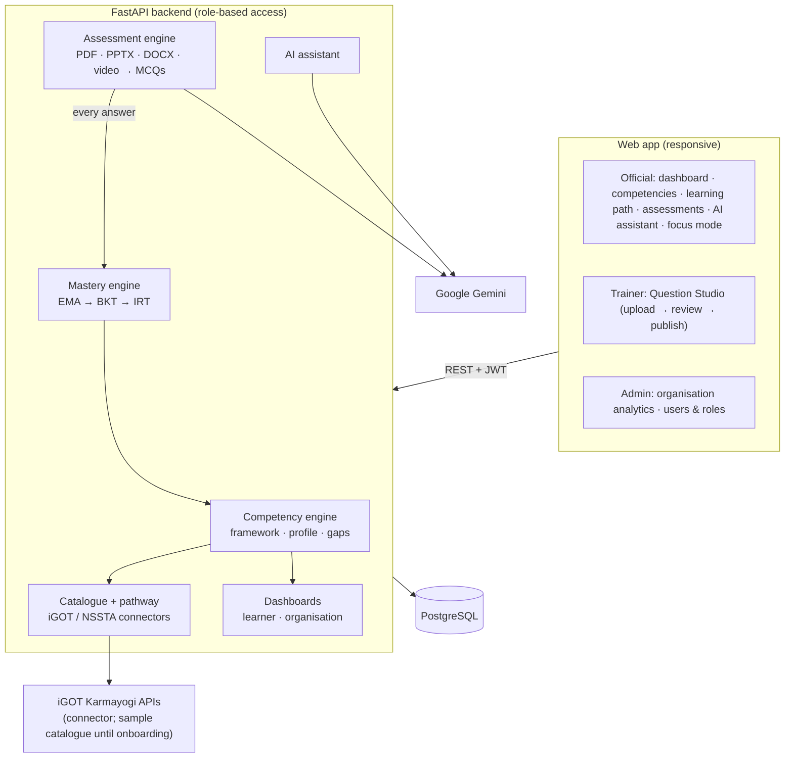

# Anvesh

### AI Skill Intelligence & Learning Platform for India's Official Statistical System
**Smart India Hackathon 2026 · Problem Statement SIH26101 · MoSPI (DIID) · Smart Education**

[](backend)
[-4169E1.svg?logo=postgresql&logoColor=white)](backend/app/models.py)
[](backend/app/assess)
[](backend/app/recommendation)
[](LICENSE)

---

## The Problem

Officials of India's Official Statistical System must keep pace with AI/ML, big data, GIS, cloud and modern statistical methods.
iGOT Karmayogi offers a vast course repository, but there is no intelligent mechanism that:

- builds a **competency profile** for each official from their role, experience and training history,
- measures it against a **competency framework for Official Statistics** and finds **skill gaps**,
- recommends a **personalized pathway** of iGOT Karmayogi courses and NSSTA (TPAC-recommended) programmes,
- lets trainers **generate assessments from their own learning material** instead of writing them by hand,
- gives administrators **organisation-wide insight** into competencies, training effectiveness and emerging needs.

## The Solution

| PS 26101 requirement | Where it lives |
|---|---|
| Competency profile from designation, department, role, assignment, qualifications, experience, trainings | `backend/app/competency/router.py` (`/api/competency/profile`), `frontend/src/app/profile-setup.tsx` |
| Competency framework: Statistical, Technical, Digital Governance, Behavioural (33 competencies) and 7 MoSPI roles | `backend/app/competency/framework.py` |
| AI-based competency assessment | Diagnostic MCQs per competency (LLM) + mastery engine EMA → BKT → IRT (`backend/app/recommendation`) |
| Automated skill-gap analysis | `backend/app/competency/levels.py` — gap = role requirement − current level, prerequisites first |
| iGOT Karmayogi + NSSTA/TPAC recommendations | Catalogue connectors `backend/app/catalog/connectors.py`, gap-based ranking `backend/app/catalog/recommend.py` |
| Enrolment, completion, automatic competency updates | `/api/courses/*` — completion quiz (70%) completes the enrolment; every answer updates mastery |
| MCQs & quizzes from uploaded documents, presentations, videos | Intelligent Assessment Engine `backend/app/assess` — PDF/PPTX/DOCX/TXT/YouTube → referenced sections → validated MCQs with explanations and source (page / slide / timestamp); trainer review + publish |
| Instant evaluation, explanations, personalized feedback | `/api/assessments/{id}/answer` — per-answer feedback + live competency level |
| AI virtual assistant | `backend/app/chatbot.py` — knows the official's role and top gaps; text, voice, image, PDF; replies in the learner's language |
| Learner dashboard | `/api/dashboard/me` — readiness, domains, gaps, learning hours, courses, assessments |
| Administrator dashboard | `/api/dashboard/org` — competency distribution, readiness by department/role, priority and emerging needs, training effectiveness, projected readiness |
| Role-based access control | `users.role` (learner / trainer / admin), `require_role` dependency; JWT auth, SSO-ready |
| Web platform | Same codebase runs as a responsive web app (`npx expo export -p web`); the same code can also build an Android app |

### Honest status of integrations

- **iGOT Karmayogi APIs** require government onboarding. The platform ships a connector interface with a clearly labelled **sample catalogue** (iGOT-style courses + NSSTA programmes under NSSTA's real programme categories). A live connector only implements `fetch()`.
- **SSO**: authentication is JWT today; the auth layer is isolated so a government IdP (e.g. Parichay) can be plugged in.

## Demo accounts

Run `python -m scripts.seed_ps26101` (from `backend/`) to create them plus 24 synthetic officials for the admin analytics.

| Role | Email | Password |
|---|---|---|
| Official (learner) | `officer@anvesh.in` | `demo1234` |
| Trainer (NSSTA) | `trainer@anvesh.in` | `demo1234` |
| Administrator | `admin@anvesh.in` | `demo1234` |

## PS 26101 API

| Method | Endpoint | Description |
| :--- | :--- | :--- |
| GET | `/api/competency/framework` | Domains, 33 competencies, 7 roles with required levels |
| GET/PUT | `/api/competency/profile` | Official's competency profile |
| GET | `/api/competency/me` | Levels, gaps (ranked), readiness |
| GET | `/api/competency/{id}/diagnostic` | Shared diagnostic quiz (202 while generating) |
| POST | `/api/materials` | Trainer upload (file or YouTube link) → quiz generation |
| GET | `/api/materials` | Trainer's materials and generation status |
| GET | `/api/assessments` / `/api/assessments/{id}` | Published quizzes / one quiz (answers hidden from learners) |
| PATCH, PUT, DELETE | `/api/assessments/{id}[/questions/{qid}]` | Trainer review: publish, edit, delete |
| POST | `/api/assessments/{id}/answer` | Instant feedback + competency update |
| POST | `/api/assessments/{id}/finish` | Save attempt; completes a course on pass |
| GET | `/api/courses` · `/recommended` · `/mine` | Catalogue, personalized pathway, my enrolments |
| POST | `/api/courses/{id}/enrol` · `/progress` | Enrolment and progress |
| GET | `/api/courses/{id}/quiz` | Course completion quiz |
| POST | `/api/courses/sync` | Admin: pull catalogue through connectors |
| GET | `/api/dashboard/me` · `/org` | Learner and administrator dashboards |
| GET/PATCH | `/api/dashboard/users[/{id}]` | Admin: users and roles |

---

## Architecture


```mermaid
flowchart TB
    subgraph Client["Web app (responsive)"]
        L["Official: dashboard · competencies · learning path · assessments · AI assistant · focus mode"]
        T["Trainer: Question Studio (upload → review → publish)"]
        A["Admin: organisation analytics · users & roles"]
    end
    subgraph API["FastAPI backend (role-based access)"]
        C["Competency engine<br/>framework · profile · gaps"]
        M["Mastery engine<br/>EMA → BKT → IRT"]
        R["Catalogue + pathway<br/>iGOT / NSSTA connectors"]
        Q["Assessment engine<br/>PDF · PPTX · DOCX · video → MCQs"]
        D["Dashboards<br/>learner · organisation"]
        AI["AI assistant"]
    end
    LLM["Google Gemini"]
    DB[("PostgreSQL")]
    IGOT["iGOT Karmayogi APIs<br/>(connector; sample catalogue until onboarding)"]
    Client -->|REST + JWT| API
    Q --> LLM
    AI --> LLM
    R --> IGOT
    API --> DB
    Q -->|every answer| M
    M --> C
    C --> R
    C --> D
```

## Mastery engine phases

| Phase | Algorithm | Data required | Activation | Key formula |
| :--- | :--- | :--- | :--- | :--- |
| **0 — EMA** | Exponential Moving Average | Zero | Day 1 | `mastery(t) = 0.3 × correct(t) + 0.7 × mastery(t-1)` |
| **1 — BKT** | Bayesian Knowledge Tracing (HMM) | 200+ attempts per competency | Auto | Forward algorithm: P(L), P(T), P(G), P(S) |
| **2 — IRT** | Item Response Theory (2PL) | 200+ responses per item, 10+ officials | Auto | `P(correct) = 1 / (1 + exp(-a(θ-b)))` |
| **3 — DKT** | Deep Knowledge Tracing (LSTM) | 1000+ officials | Roadmap | Sequence model over attempt histories |

Competency level (0–5) = mastery × 5. Until an official is assessed on a competency, a conservative estimate (max 3) is read from their profile.

## Local development

```bash
# Backend
cd backend
pip install -r requirements.txt
cp ../.env.example .env          # DATABASE_URL, JWT_SECRET, GEMINI_API_KEY (YOUTUBE_API_KEY optional)
alembic upgrade head
python -m scripts.seed_ps26101   # demo accounts + synthetic officials
uvicorn app.main:app --reload --port 8000

# App (web)
cd frontend
npm install
npx expo start --web             # API defaults to http://localhost:8000; set EXPO_PUBLIC_API_URL to change
```

## Deployment

- **API:** Render (`render.yaml`, service `anvesh-api`).
- **Web app:** Vercel, root directory `frontend` (`frontend/vercel.json`), env `EXPO_PUBLIC_API_URL=https://anvesh-api.onrender.com`.

## Project structure

```
backend/app/
├── competency/   framework.py (33 competencies, 7 roles) · levels.py (estimates, gaps) · router.py
├── assess/       extract.py (PDF/PPTX/DOCX/TXT) · generate.py (LLM MCQs) · router.py (materials, quizzes, diagnostics)
├── catalog/      connectors.py (iGOT / NSSTA) · recommend.py (gap-based ranking) · router.py (courses, enrolment)
├── dashboard/    router.py (learner + organisation analytics, roles)
├── recommendation/  EMA · BKT · IRT · orchestrator (mastery engine)
├── trails/       video reading used by the assessment engine (captions → Gemini → titles)
├── chatbot.py    AI assistant · attachments.py · events.py · auth.py · models.py
backend/scripts/seed_ps26101.py   demo data
frontend/src/app/
├── (tabs)/       index (dashboard) · competencies · courses · assessments · chat
├── assess/[id]   quiz player · course/[id] · profile-setup · studio (+ studio/[id]) · admin · admin-users · pomodoro
```

## Research & References

1. **Corbett, A. T., & Anderson, J. R. (1995).** Knowledge Tracing: Modeling the Acquisition of Procedural Knowledge. *User Modeling and User-Adapted Interaction*, 4(4), 253-278. — *BKT*
2. **Embretson, S. E., & Reise, S. P. (2000).** *Item Response Theory for Psychologists*. Lawrence Erlbaum Associates. — *IRT 2PL*
3. **Piech, C., et al. (2015).** Deep Knowledge Tracing. *NeurIPS*. — *Roadmap phase*
4. **Government of India (2020).** Mission Karmayogi — National Programme for Civil Services Capacity Building (NPCSCB). — *Competency-driven capacity building on iGOT Karmayogi*
5. **National Statistical Systems Training Academy (NSSTA), MoSPI.** Training programmes for the Official Statistical System — nssta.gov.in
6. **United Nations (2014).** Fundamental Principles of Official Statistics. — *Ethics competency*

---

## License

This project is licensed under the **[MIT License](LICENSE)**.
