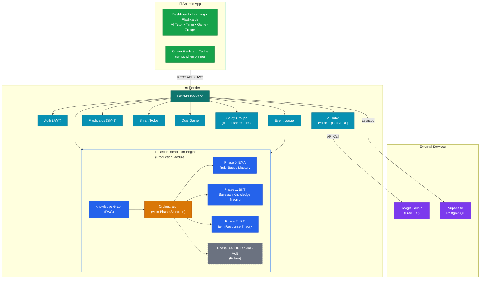
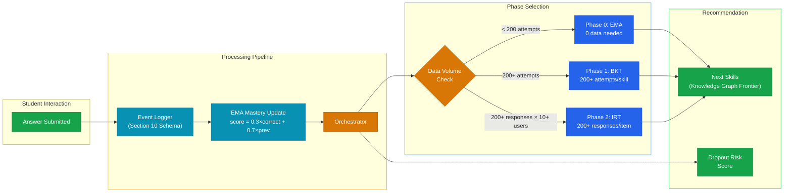
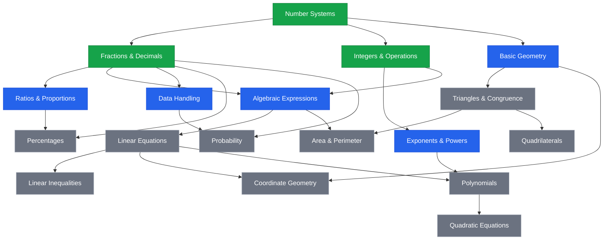

# Anvesh

### AI Skill Intelligence & Learning Platform for India's Official Statistical System
**Smart India Hackathon 2026 · Problem Statement SIH26101 · MoSPI (DIID) · Smart Education**

> This branch (`ps-26101`) is the SIH26101 edition. The original Smart Education edition (school students, YouTube Trails) lives on `master`.

[](backend)
[-4169E1.svg?logo=postgresql&logoColor=white)](backend/app/models.py)
[](backend/app/assess)
[](backend/app/recommendation)
[](LICENSE)

---

## The Problem

Officials of India's Official Statistical System must keep pace with AI/ML, big data, GIS, cloud and modern statistical methods.
iGOT Karmayogi offers a vast course repository, but there is no intelligent mechanism that:

- builds a **competency profile** for each official from their role, experience and training history,
- measures it against a **competency framework for Official Statistics** and finds **skill gaps**,
- recommends a **personalized pathway** of iGOT Karmayogi courses and NSSTA (TPAC-recommended) programmes,
- lets trainers **generate assessments from their own learning material** instead of writing them by hand,
- gives administrators **organisation-wide insight** into competencies, training effectiveness and emerging needs.

## The Solution

| PS 26101 requirement | Where it lives |
|---|---|
| Competency profile from designation, department, role, assignment, qualifications, experience, trainings | `backend/app/competency/router.py` (`/api/competency/profile`), `frontend/src/app/profile-setup.tsx` |
| Competency framework: Statistical, Technical, Digital Governance, Behavioural (33 competencies) and 7 MoSPI roles | `backend/app/competency/framework.py` |
| AI-based competency assessment | Diagnostic MCQs per competency (LLM) + mastery engine EMA → BKT → IRT (`backend/app/recommendation`) |
| Automated skill-gap analysis | `backend/app/competency/levels.py` — gap = role requirement − current level, prerequisites first |
| iGOT Karmayogi + NSSTA/TPAC recommendations | Catalogue connectors `backend/app/catalog/connectors.py`, gap-based ranking `backend/app/catalog/recommend.py` |
| Enrolment, completion, automatic competency updates | `/api/courses/*` — completion quiz (70%) completes the enrolment; every answer updates mastery |
| MCQs & quizzes from uploaded documents, presentations, videos | Intelligent Assessment Engine `backend/app/assess` — PDF/PPTX/DOCX/TXT/YouTube → referenced sections → validated MCQs with explanations and source (page / slide / timestamp); trainer review + publish |
| Instant evaluation, explanations, personalized feedback | `/api/assessments/{id}/answer` — per-answer feedback + live competency level |
| AI virtual assistant | `backend/app/chatbot.py` — knows the official's role and top gaps; text, voice, image, PDF; replies in the learner's language |
| Learner dashboard | `/api/dashboard/me` — readiness, domains, gaps, learning hours, courses, assessments |
| Administrator dashboard | `/api/dashboard/org` — competency distribution, readiness by department/role, priority and emerging needs, training effectiveness, projected readiness |
| Role-based access control | `users.role` (learner / trainer / admin), `require_role` dependency; JWT auth, SSO-ready |
| Web platform | Same codebase runs as a responsive web app (`npx expo export -p web`) and an Android app |

### Honest status of integrations

- **iGOT Karmayogi APIs** require government onboarding. The platform ships a connector interface with a clearly labelled **sample catalogue** (iGOT-style courses + NSSTA programmes under NSSTA's real programme categories). A live connector only implements `fetch()`.
- **SSO**: authentication is JWT today; the auth layer is isolated so a government IdP (e.g. Parichay) can be plugged in.

## Demo accounts

Run `python -m scripts.seed_ps26101` (from `backend/`) to create them plus 24 synthetic officials for the admin analytics.

| Role | Email | Password |
|---|---|---|
| Official (learner) | `officer@anvesh.in` | `demo1234` |
| Trainer (NSSTA) | `trainer@anvesh.in` | `demo1234` |
| Administrator | `admin@anvesh.in` | `demo1234` |

## PS 26101 API

| Method | Endpoint | Description |
| :--- | :--- | :--- |
| GET | `/api/competency/framework` | Domains, 33 competencies, 7 roles with required levels |
| GET/PUT | `/api/competency/profile` | Official's competency profile |
| GET | `/api/competency/me` | Levels, gaps (ranked), readiness |
| GET | `/api/competency/{id}/diagnostic` | Shared diagnostic quiz (202 while generating) |
| POST | `/api/materials` | Trainer upload (file or YouTube link) → quiz generation |
| GET | `/api/materials` | Trainer's materials and generation status |
| GET | `/api/assessments` / `/api/assessments/{id}` | Published quizzes / one quiz (answers hidden from learners) |
| PATCH, PUT, DELETE | `/api/assessments/{id}[/questions/{qid}]` | Trainer review: publish, edit, delete |
| POST | `/api/assessments/{id}/answer` | Instant feedback + competency update |
| POST | `/api/assessments/{id}/finish` | Save attempt; completes a course on pass |
| GET | `/api/courses` · `/recommended` · `/mine` | Catalogue, personalized pathway, my enrolments |
| POST | `/api/courses/{id}/enrol` · `/progress` | Enrolment and progress |
| GET | `/api/courses/{id}/quiz` | Course completion quiz |
| POST | `/api/courses/sync` | Admin: pull catalogue through connectors |
| GET | `/api/dashboard/me` · `/org` | Learner and administrator dashboards |
| GET/PATCH | `/api/dashboard/users[/{id}]` | Admin: users and roles |

---

## Platform internals (shared with the original edition)

## System Architecture


```mermaid
flowchart TB
    subgraph Client["📱 Android App"]
        FE["Dashboard • Learning • Flashcards<br/>AI Tutor • Timer • Game • Groups"]
        CACHE["Offline Flashcard Cache<br/>(syncs when online)"]
    end

    subgraph Render["☁️ Render"]
        API["FastAPI Backend"]
        subgraph RecEngine["🧠 Recommendation Engine<br/>(Production Module)"]
            KG["Knowledge Graph<br/>(DAG)"]
            ORC["Orchestrator<br/>(Auto Phase Selection)"]
            EMA["Phase 0: EMA<br/>Rule-Based Mastery"]
            BKT["Phase 1: BKT<br/>Bayesian Knowledge Tracing"]
            IRT["Phase 2: IRT<br/>Item Response Theory"]
            FUTURE["Phase 3-4: DKT / Semi-MoE<br/>(Future)"]
        end
        AUTH["Auth (JWT)"]
        CHAT["AI Tutor<br/>(voice + photo/PDF)"]
        FLASH["Flashcards (SM-2)"]
        TODOS["Smart Todos"]
        GAME["Quiz Game"]
        GROUPS["Study Groups<br/>(chat + shared files)"]
        EVENTS["Event Logger"]
    end

    subgraph External["External Services"]
        GEMINI["Google Gemini<br/>(Free Tier)"]
        SUPA["Supabase<br/>PostgreSQL"]
    end

    Client -->|REST API + JWT| API
    API --> RecEngine
    API --> AUTH
    API --> CHAT
    API --> FLASH
    API --> TODOS
    API --> GAME
    API --> GROUPS
    API --> EVENTS
    EVENTS --> RecEngine
    ORC --> EMA
    ORC --> BKT
    ORC --> IRT
    ORC -.-> FUTURE
    KG --> ORC
    CHAT -->|API Call| GEMINI
    API -->|asyncpg| SUPA

    style RecEngine stroke:#3b82f6,stroke-width:2px
    style FUTURE stroke:#9ca3af,stroke-dasharray: 5 5
    style Client stroke:#22c55e

    classDef app fill:#16a34a,stroke:#15803d,color:#fff
    classDef api fill:#0f766e,stroke:#115e59,color:#fff
    classDef svc fill:#0891b2,stroke:#0e7490,color:#fff
    classDef rec fill:#2563eb,stroke:#1d4ed8,color:#fff
    classDef orch fill:#d97706,stroke:#b45309,color:#fff
    classDef ext fill:#7c3aed,stroke:#6d28d9,color:#fff
    classDef future fill:#6b7280,stroke:#9ca3af,stroke-dasharray: 5 5,color:#fff
    class FE,CACHE app
    class API api
    class AUTH,CHAT,FLASH,TODOS,GAME,GROUPS,EVENTS svc
    class KG,EMA,BKT,IRT rec
    class ORC orch
    class GEMINI,SUPA ext
    class FUTURE future
```

### Recommendation Engine Pipeline


```mermaid
flowchart LR
    subgraph Input["Student Interaction"]
        ANS["Answer Submitted"]
    end

    subgraph Pipeline["Processing Pipeline"]
        LOG["Event Logger<br/>(Section 10 Schema)"]
        UPD["EMA Mastery Update<br/>score = 0.3×correct + 0.7×prev"]
        ORC["Orchestrator"]
    end

    subgraph Phases["Phase Selection"]
        direction TB
        CHECK{"Data Volume<br/>Check"}
        P0["Phase 0: EMA<br/>0 data needed"]
        P1["Phase 1: BKT<br/>200+ attempts/skill"]
        P2["Phase 2: IRT<br/>200+ responses/item"]
    end

    subgraph Output["Recommendation"]
        REC["Next Skills<br/>(Knowledge Graph Frontier)"]
        RISK["Dropout Risk<br/>Score"]
    end

    ANS --> LOG --> UPD --> ORC --> CHECK
    CHECK -->|"< 200 attempts"| P0
    CHECK -->|"200+ attempts"| P1
    CHECK -->|"200+ responses × 10+ users"| P2
    P0 --> REC
    P1 --> REC
    P2 --> REC
    ORC --> RISK

    style Pipeline stroke:#f59e0b
    style Phases stroke:#3b82f6
    style Output stroke:#22c55e

    classDef app fill:#16a34a,stroke:#15803d,color:#fff
    classDef api fill:#0f766e,stroke:#115e59,color:#fff
    classDef svc fill:#0891b2,stroke:#0e7490,color:#fff
    classDef rec fill:#2563eb,stroke:#1d4ed8,color:#fff
    classDef orch fill:#d97706,stroke:#b45309,color:#fff
    classDef ext fill:#7c3aed,stroke:#6d28d9,color:#fff
    classDef future fill:#6b7280,stroke:#9ca3af,stroke-dasharray: 5 5,color:#fff
    classDef out fill:#16a34a,stroke:#15803d,color:#fff
    class ANS app
    class LOG,UPD svc
    class ORC,CHECK orch
    class P0,P1,P2 rec
    class REC,RISK out
```

---

## What Makes Anvesh Different

### 1. Multi-Phase Adaptive Engine That Evolves With Data
Most EdTech platforms pick one recommendation algorithm and stick with it. Anvesh implements a **progressive phase architecture**: rule-based EMA on Day 1 (zero data), Bayesian Knowledge Tracing at 200 attempts, Item Response Theory at 200 responses per item. The orchestrator auto-selects the best phase per skill — the system becomes more intelligent automatically as students use it, with no manual tuning or redeployment.

### 2. Knowledge Graph-Driven Prerequisite Paths
Skills are modeled as a **Directed Acyclic Graph (DAG)** with prerequisite edges. The recommendation engine performs frontier analysis: it finds the deepest unmastered skill whose prerequisites are all mastered. This guarantees students never encounter content they're not ready for, and never waste time on content they've already mastered.

### 3. Production-Grade Reusable Module
The `recommendation/` package is designed as a **standalone microservice** with a stable `SkillStateProvider` interface. It can be extracted and integrated into any existing EdTech platform via HTTP. Already on the production roadmap of ARiTHi Education Technology.

### 4. Event Logging Pipeline from Day 1
Every student interaction (answers, response times, video watches, hints) is recorded in a structured schema from the first session. This isn't just analytics — it's the **training data pipeline** that enables BKT, IRT, and future deep learning phases. Most platforms bolt on analytics later; Anvesh treats data collection as a core architectural requirement.

### 5. Scientifically Backed Retention System
SM-2 spaced repetition (Wozniak 1994) is integrated directly into the learning flow, not as a separate app. Flashcards are linked to knowledge graph skills. The system knows what you're learning and schedules reviews accordingly.

---

## Feature Comparison

| Capability | Anvesh | Traditional EdTech Platforms |
| :--- | :--- | :--- |
| **Content Recommendation** | **Multi-phase adaptive** (EMA → BKT → IRT → DKT) | Static grade-based or collaborative filtering |
| **Prerequisite Modeling** | **Knowledge Graph DAG** with frontier analysis | Flat topic lists or manual course ordering |
| **Cold Start** | **Zero data needed** — Phase 0 works instantly | Requires historical data or manual setup |
| **Algorithm Evolution** | **Auto-upgrades** as data accumulates | Fixed algorithm, manual model retraining |
| **Retention System** | **SM-2 spaced repetition** linked to skills | Separate flashcard apps or no spaced repetition |
| **Dropout Detection** | **Risk scoring** from learning event patterns | No early warning system |
| **AI Tutoring** | **Context-aware chatbot** (Gemini, knows current skill) | Generic chatbot or no AI support |
| **Collaboration** | **Study groups** with chat, shared files and shared decks | No peer learning features |
| **Offline Support** | **Offline flashcard review** that syncs when back online | Requires constant internet |
| **Data Pipeline** | **Event logging from Day 1** for ML readiness | Analytics added as an afterthought |

---

## Tech Stack

| Layer | Technology | Purpose |
| :--- | :--- | :--- |
| **Backend API** | FastAPI, Python 3.13 | Async REST API, Pydantic validation |
| **Database** | PostgreSQL 16 (Supabase) | 14-table schema, event logging pipeline |
| **ORM & Migrations** | SQLAlchemy (async) + Alembic | Type-safe models, version-controlled schema |
| **Recommendation** | NumPy, SciPy | EMA, BKT (HMM), IRT (2PL MLE) |
| **AI Chatbot** | Google Gemini API | Context-aware tutoring, free tier |
| **Auth** | python-jose, passlib (bcrypt) | JWT token authentication |
| **Mobile App** | Expo SDK 57, React Native, Expo Router | Android app (APK), expo-audio voice input |
| **Deployment** | Render (API), Supabase (DB), EAS / GitHub Actions (APK) | Zero-cost free tier deployment |

---

## Knowledge Graph

The recommendation engine works on a skill prerequisite graph: a skill is recommended only once all its prerequisites are mastered. In the app, skills are the topics of a student's trails: Gemini proposes the prerequisites when a playlist is imported, and students can edit them on each topic's screen (cycles are rejected). Example graph for 8th grade mathematics (18 skills), shown for a student who has mastered the first three:


```mermaid
flowchart TD
    NUM["Number Systems"] --> FRAC["Fractions & Decimals"]
    NUM --> INT["Integers & Operations"]
    NUM --> GEO["Basic Geometry"]
    INT --> EXP["Exponents & Powers"]
    FRAC --> RAT["Ratios & Proportions"]
    INT --> ALG["Algebraic Expressions"]
    FRAC --> ALG
    GEO --> TRI["Triangles & Congruence"]
    FRAC --> DATA["Data Handling"]
    ALG --> LEQ["Linear Equations"]
    RAT --> PCT["Percentages"]
    FRAC --> PCT
    TRI --> AREA["Area & Perimeter"]
    ALG --> AREA
    TRI --> QUAD["Quadrilaterals"]
    DATA --> PROB["Probability"]
    FRAC --> PROB
    LEQ --> LINEQ["Linear Inequalities"]
    LEQ --> COORD["Coordinate Geometry"]
    GEO --> COORD
    LEQ --> POLY["Polynomials"]
    EXP --> POLY
    POLY --> QEQN["Quadratic Equations"]

    classDef mastered fill:#16a34a,stroke:#15803d,color:#fff
    classDef available fill:#2563eb,stroke:#1d4ed8,color:#fff
    classDef locked fill:#6b7280,stroke:#9ca3af,color:#fff
    class NUM,FRAC,INT mastered
    class GEO,EXP,RAT,ALG,DATA available
    class TRI,LEQ,PCT,AREA,QUAD,PROB,LINEQ,COORD,POLY,QEQN locked
```

**Legend:** 🟢 Mastered · 🔵 Available (all prerequisites mastered, so it can be recommended) · ⚪ Locked

---

## Recommendation Engine Phases

| Phase | Algorithm | Data Required | Activation | Key Formula |
| :--- | :--- | :--- | :--- | :--- |
| **0 — EMA** | Exponential Moving Average | Zero | Day 1 | `mastery(t) = 0.3 × correct(t) + 0.7 × mastery(t-1)` |
| **1 — BKT** | Bayesian Knowledge Tracing (HMM) | 200+ attempts/skill | Auto | Forward algorithm: P(L), P(T), P(G), P(S) |
| **2 — IRT** | Item Response Theory (2PL) | 200+ responses/item, 10+ users | Auto | `P(correct) = 1 / (1 + exp(-a(θ-b)))` |
| **3 — DKT** | Deep Knowledge Tracing (LSTM) | 1000+ students | Future | Sequence model over attempt histories |
| **4 — Semi-MoE** | Mixture-of-Experts Transformer | 5000+ students | Future | Expert routing by content type |

The `SkillStateProvider` interface remains identical across all phases. The orchestrator auto-selects the highest viable phase per skill:

```
IRT (most data) → BKT → EMA (fallback)
```

---

## Local Development Setup

### 1. Prerequisites

- [Miniconda](https://docs.conda.io/en/latest/miniconda.html) or Python 3.13+
- [Docker](https://www.docker.com/) (for local PostgreSQL) or a [Supabase](https://supabase.com/) project
- [Node.js 22.13+](https://nodejs.org/) (for the Expo app)

### 2. Backend Setup

```bash
# Create conda environment
conda create -n anvesh python=3.13 -y
conda activate anvesh

# Install dependencies
cd backend
pip install -r requirements.txt

# Configure environment
cp .env.example .env
# Edit .env with your DATABASE_URL, JWT_SECRET, GEMINI_API_KEY (and optionally YOUTUBE_API_KEY: servers are bot-blocked by YouTube, the Data API is not)

# Start local PostgreSQL (if using Docker)
cd ..
docker compose up -d

# Run database migrations
cd backend
alembic upgrade head

# Seed demo accounts
python seed.py

# Start the server
uvicorn app.main:app --reload --port 8000
```

### 3. Frontend Setup

```bash
cd frontend
npm install
# API defaults to http://localhost:8000; set EXPO_PUBLIC_API_URL to point elsewhere
npx expo start
```

### 4. Demo Credentials

| Name | Email | Password |
| :--- | :--- | :--- |
| Demo Student (original edition) | `demo@anvesh.in` | `demo1234` |
| Adarsh | `adarsh@anvesh.in` | `adarsh1234` |
| Test Student | `test@anvesh.in` | `test1234` |

---

## Project Structure

```
Anvesh/
├── backend/
│   ├── app/
│   │   ├── recommendation/              # Production-grade reusable module
│   │   │   ├── interface.py              # SkillStateProvider protocol (stable contract)
│   │   │   ├── knowledge_graph.py        # DAG loader, validation, frontier analysis
│   │   │   ├── ema.py                    # Phase 0 — EMA mastery tracking
│   │   │   ├── bkt.py                    # Phase 1 — Bayesian Knowledge Tracing (HMM + EM fitting)
│   │   │   ├── irt.py                    # Phase 2 — Item Response Theory (2PL + MLE)
│   │   │   ├── orchestrator.py           # Auto phase selection per skill
│   │   │   ├── event_logger.py           # Section 10 event instrumentation
│   │   │   └── router.py                 # /api/recommend/* endpoints
│   │   ├── auth.py                       # JWT authentication + demo accounts
│   │   ├── chatbot.py                    # Google Gemini AI tutor + persistent history
│   │   ├── flashcards.py                 # CRUD + SM-2 spaced repetition
│   │   ├── todos.py                      # Smart todos + carry-forward + suggestions
│   │   ├── trails/                       # Trails: import, topic plans, overlap, grounding, question bank
│   │   ├── llm.py                        # Gemini calls with model fallback
│   │   ├── videos.py                     # Lesson detail + student-added videos
│   │   ├── study_groups.py               # Groups, invite codes, shared decks
│   │   ├── game.py                       # Quiz game (unlocks after study time)
│   │   ├── models.py                     # 14 SQLAlchemy models
│   │   ├── main.py                       # FastAPI application entrypoint
│   │   ├── config.py                     # Pydantic settings
│   │   ├── database.py                   # Async SQLAlchemy engine
│   │   └── deps.py                       # Auth dependency injection
│   ├── data/
│   │   └── knowledge_graph.json          # Example knowledge graph (docs only; app skills live in the DB)
│   ├── alembic/                          # Database migrations
│   ├── seed.py                           # Demo account seeder
│   ├── requirements.txt
│   └── Dockerfile
├── frontend/                             # Expo / React Native Android app
├── docs/
│   ├── ppt-script.md                     # SIH 2026 presentation content
│   ├── frontend-guide.md                 # Frontend implementation guide with all API specs
│   └── diagrams.md                       # Mermaid architecture diagrams
├── docker-compose.yml                    # Local PostgreSQL
└── .env.example
```

---

## API Reference

### Authentication
| Method | Endpoint | Description |
| :--- | :--- | :--- |
| POST | `/api/auth/login` | Login with email + password → JWT token |
| POST | `/api/auth/register` | Register new account → JWT token |

### Recommendation Engine
| Method | Endpoint | Description |
| :--- | :--- | :--- |
| GET | `/api/recommend/next` | Get next recommended skills + videos |
| POST | `/api/recommend/answer` | Submit answer → updates mastery + recommendations |
| GET | `/api/recommend/mastery` | All skill mastery scores for current user |
| GET | `/api/recommend/mastery/{skill_id}` | Single skill mastery + active phase |
| GET | `/api/recommend/graph` | Full knowledge graph with node statuses |
| GET | `/api/recommend/dropout-risk` | Current dropout risk score |
| GET | `/api/recommend/videos/{skill_id}` | Lessons for a topic |

### Trails
| Method | Endpoint | Description |
| :--- | :--- | :--- |
| GET | `/api/trails` | My trails with progress and next topic |
| POST | `/api/trails` | Create a trail from a playlist or video link |
| GET | `/api/trails/{id}` | Trail map: topics, statuses, sources |
| DELETE | `/api/trails/{id}` | Delete a trail |
| POST | `/api/trails/{id}/sources` | Add another playlist to a trail |
| POST | `/api/trails/{id}/sources/{sid}/retry` | Retry a failed import |
| POST | `/api/trails/{id}/sources/{sid}/rebuild` | Rebuild a source's topics |
| GET | `/api/topics/{id}/notes` | Grounded key concepts (`?prepare=true` starts grounding) |
| GET | `/api/topics/{id}/lessons/{lid}/check` | Quick check questions for one lesson |

### Chatbot
| Method | Endpoint | Description |
| :--- | :--- | :--- |
| POST | `/api/chat` | Send message → Gemini reply |
| GET | `/api/chat/history` | Retrieve chat history |

### Flashcards
| Method | Endpoint | Description |
| :--- | :--- | :--- |
| GET | `/api/flashcards` | List all cards (filterable by skill_id) |
| GET | `/api/flashcards/due` | Cards due for review today |
| POST | `/api/flashcards` | Create a flashcard |
| PUT | `/api/flashcards/{id}` | Update a flashcard |
| DELETE | `/api/flashcards/{id}` | Delete a flashcard |
| POST | `/api/flashcards/{id}/review` | SM-2 review (quality 0-5) |

### Todos
| Method | Endpoint | Description |
| :--- | :--- | :--- |
| GET | `/api/todos` | List all todos |
| POST | `/api/todos` | Create a todo |
| PUT | `/api/todos/{id}` | Update a todo |
| DELETE | `/api/todos/{id}` | Delete a todo |
| POST | `/api/todos/carry-forward` | Move incomplete past-due todos to today |
| GET | `/api/todos/suggested` | Knowledge graph-based study suggestions |

### Videos
| Method | Endpoint | Description |
| :--- | :--- | :--- |
| GET | `/api/videos/detail/{video_id}` | Lesson detail: range, concepts, neighbours |
| POST | `/api/videos` | Add a YouTube video to a topic |
| DELETE | `/api/videos/{video_id}` | Remove a video |

### Study Groups
| Method | Endpoint | Description |
| :--- | :--- | :--- |
| GET | `/api/groups` | My groups |
| POST | `/api/groups` | Create a group |
| POST | `/api/groups/join` | Join by invite code |
| POST | `/api/groups/{id}/share-deck` | Share flashcard deck |
| GET | `/api/groups/{id}/decks` | View shared decks |

### Game
| Method | Endpoint | Description |
| :--- | :--- | :--- |
| GET | `/api/game/practice/{skill_id}` | 5 practice questions (202 while the topic is being grounded) |
| GET | `/api/game/quiz/{skill_id}` | Get quiz questions |
| POST | `/api/game/submit` | Submit answers → score |

---

## Research & References

1. **Corbett, A. T., & Anderson, J. R. (1995).** Knowledge Tracing: Modeling the Acquisition of Procedural Knowledge. *User Modeling and User-Adapted Interaction*, 4(4), 253-278. — *BKT implementation*
2. **Embretson, S. E., & Reise, S. P. (2000).** *Item Response Theory for Psychologists*. Lawrence Erlbaum Associates. — *IRT 2PL model*
3. **Piech, C., et al. (2015).** Deep Knowledge Tracing. *NeurIPS*. — *Future Phase 3 architecture*
4. **Wozniak, P. A., & Gorzelanczyk, E. J. (1994).** Optimization of repetition spacing in the practice of learning. *Acta Neurobiologiae Experimentalis*, 54, 59-62. — *SM-2 flashcard algorithm*
5. **Shazeer, N., et al. (2017).** Outrageously Large Neural Networks: The Sparsely-Gated Mixture-of-Experts Layer. *ICLR 2017*. — *Future Phase 4 Semi-MoE*
6. **National Education Policy 2020**, Ministry of Education, Government of India. — *Policy alignment*

---

## License

This project is licensed under the **[MIT License](LICENSE)**.
