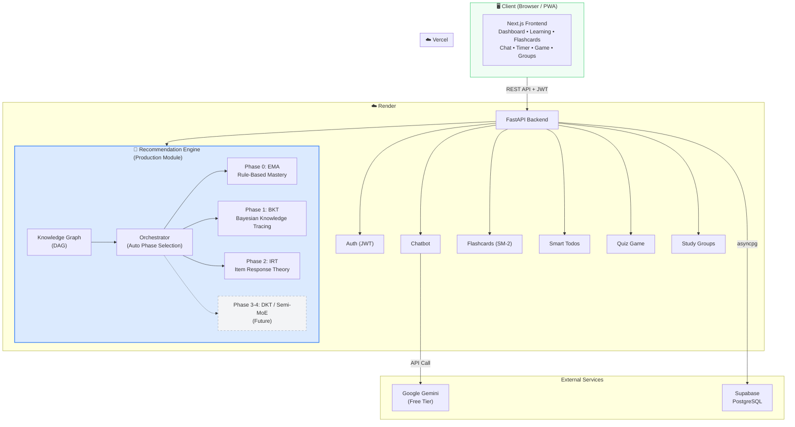
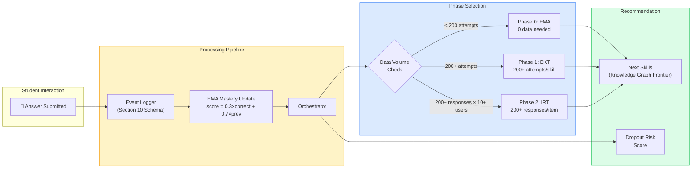
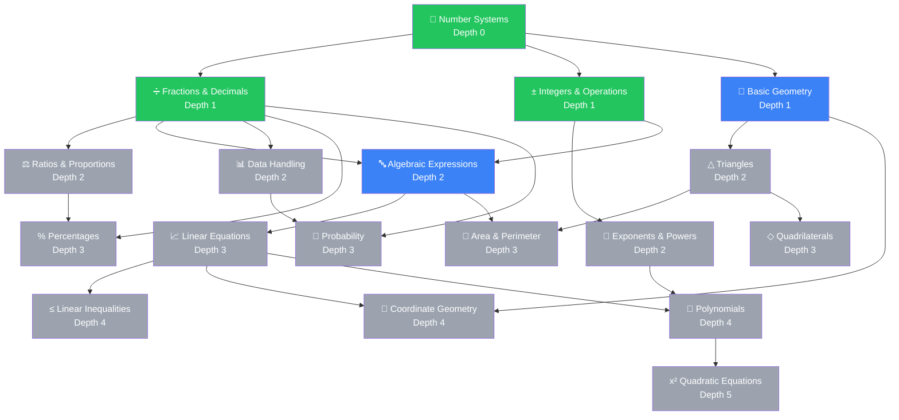
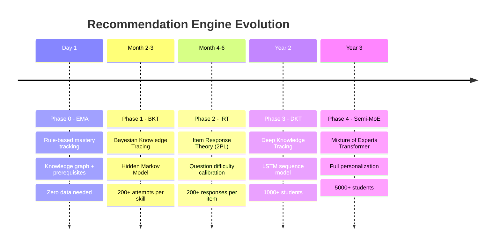
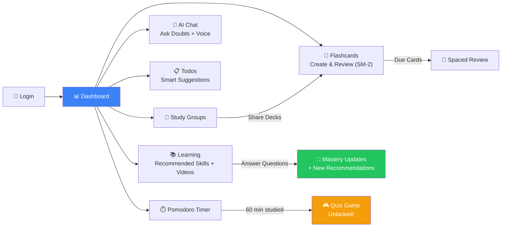

# Anvesh — Architecture Diagrams

Render these on [mermaid.live](https://mermaid.live) and export as PNG for the PPT.

---

## 1. System Architecture

---

## 2. Recommendation Engine Pipeline

---

## 3. Knowledge Graph Example (8th Grade Math)

**Legend**: 🟢 Mastered → 🔵 Available (prereqs met) → ⚪ Locked

---

## 4. Phase Evolution Timeline

---

## 5. User Flow

